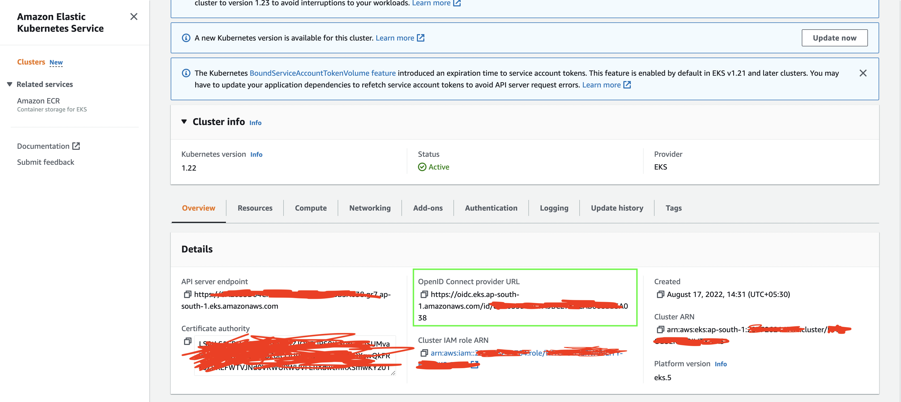
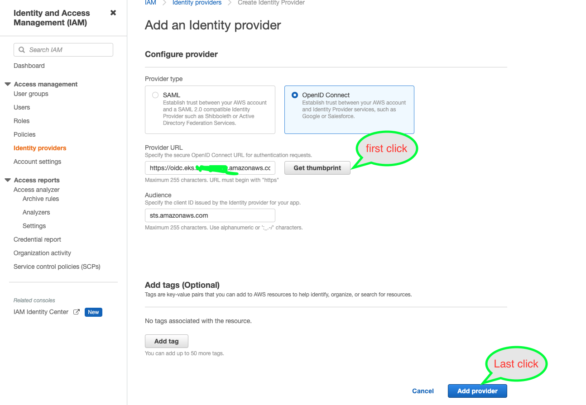
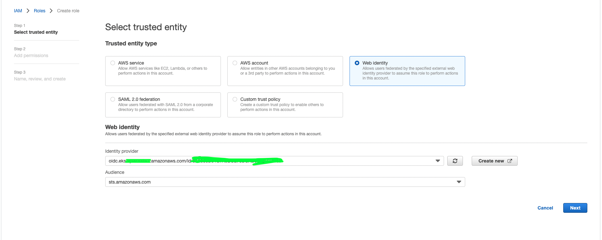
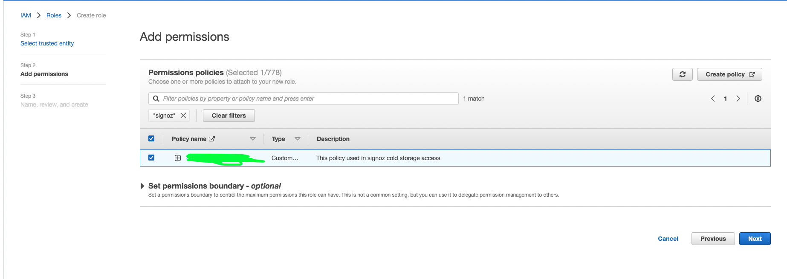

### Overview
In signoz we can configure retention period of traces and metrics separately and also set the duration after which the data will be moved to cold storage (S3) for both traces and metrics.
In AWS eks we can integrate the S3 cold storage in two ways.
1. **Using AWS access and secret keys.(For this you can refer this doc https://signoz.io/docs/userguide/retention-period/)**
2. **Using AWS IAM Role.**

To use AWS role to configure S3 cloud storage in signoz we need to add the role arn in the helm **overwrite-values.yaml** and run the helm upgrade.
   ```jsx
       clickhouse:
         cloud: aws
         # Cold storage configuration
         coldStorage:
            enabled: true
            defaultKeepFreeSpaceBytes: "10485760"
            endpoint: https://<AWS S3 DNS URL>/data/
            role:
            enabled: true
            annotations:
               eks.amazonaws.com/role-arn: arn:aws:iam::*********:role/********
   ```
But just adding the AWS role arn will not complete the integration, because here we need to associate the given IAM role with a Kubernetes service account named **clickhouse-instance**. 

Following are the steps that we need to perform step by step to complete this association of AWS Role ARN with AWS EKS service account named clickhouse-instance.

For this we will configure AWS EKS, OpenID Connect (OIDC) provider, IAM Roles and service accounts

1. **Go to EKS cluster and copy the OIDC provider URL.(inside green rectangle)**

2. **Go to AWS IAM and check if there are any IAM OIDC providers in AWS IAM for the given "CLUSTER".**
3. **If there are no IAM OIDC providers for the given "CLUSTER", then create an IAM OIDC provider. Below are the steps to create an IAM OIDC provider.**

   a. Go to IAM —---> Click on the Identity Provider -----> Click On Add provider.
   

   b. Choose **openid connect** —--> Copy EKS OIDC url into **Provider URL** and click on *Get Thumbprint** ---> Enter **sts.amazonaws.com** into the **Audience** text box ---> click on **Add Provider**.
   

4. **Create AWS S3 bucket for signoz cold storage.**

   a. Go to AWS S3 console ---> click on the **Create bucket**.
   
   b. Fill all the details like bucket name **(demo-cold-storage)**,  choose region etc and create the bucket.
      You can refere the link for more details.[AWS S3 Link](https://docs.aws.amazon.com/AmazonS3/latest/userguide/creating-bucket.html)

5. **Create an IAM S3 policy. This policy will be attached to the IAM role. Below are the IAM policy details.**
   Let us assume you create a S3 with the name **demo-cold-storage**.
      ```jsx
            {
               "Statement": [
                  {
                        "Action": [
                           "s3:GetObject",
                           "s3:GetObjectVersion",
                           "s3:PutBucketVersioning",
                           "s3:PutObject"
                        ],
                        "Effect": "Allow",
                        "Resource": [
                           "arn:aws:s3:::demo-cold-storage",
                           "arn:aws:s3:::demo-cold-storage/*"
                        ]
                  }
               ],
               "Version": "2012-10-17"
            }
      ```
6. **Create an IAM role for signoz service accounts(clickhouse-instance).**
   a. Go to AWS IAM ----> Roles ----> Create Role.
   

   b. Choose **web identity** ----> Select the above created OIDC provider from Identity provider drop down -—--> Choose **sts.amazonaws.com** from audience drop down ----> Click on Next.
   

   c. Choose the IAM S3 policy created above and click on the next button.
   

   d. Enter the role name **demo-cold-storage-role**, description and tags and create the role.
   

7. **Now update the “overwrite-values.yaml”.**
      ```jsx
         clickhouse:
            cloud: aws
            # Cold storage configuration
            coldStorage:
               enabled: true
               defaultKeepFreeSpaceBytes: "10485760"
               endpoint: https://demo-cold-storage.s3.amazonaws.com/data/
               role:
               enabled: true
               annotations:
                  eks.amazonaws.com/role-arn:arn:aws:iam::1234056789:role/demo-cold-storage-role
      ```
8. **Upgrade the helm deployment.**
   ```jsx
       helm --namespace platform upgrade <your release name> signoz/signoz -f overwrite-values.yaml    
   ```

:::info
Kindly change the name of AWS resources as per your need.    
:::